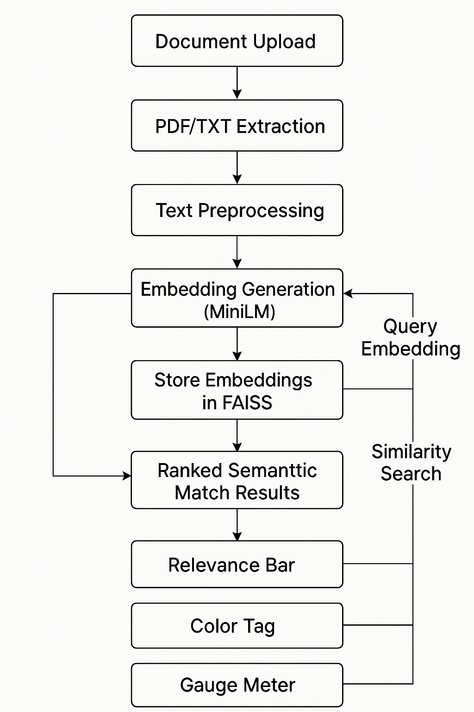

# 🔍 Semantic Search Engine (Advanced AI-Based Document Search)

A fully interactive **semantic search engine** built with:
- 🧠 **Sentence Transformers**
  
- 🚀 **FAISS Vector Database**

- 🖥️ **Streamlit UI**

- 📄 **PDF & TXT Extraction**

- 📊 **Visual Relevance Indicators (Progress Bar, Gauge, Tags)**

This project showcases how modern AI systems like **Google, ChatGPT, Netflix, Spotify, and Amazon** retrieve information based on **meaning**, not just keywords.

---

# 🖼️ UI Overview

### ⭐ Home Screen

  
   
  <b>Home Screen UI</b>

---

# ✨ Features

### 📁 1. Multi-File Upload (PDF + TXT)

Upload multiple documents at once.

  
   
  <b>File Upload Section (Left Sidebar)</b>

  
   
  <b>Uploaded Files Listed</b>

---

### 🔄 2. Embeddings + FAISS Index Generation

One-click indexing with MiniLM model + FAISS vector store.

  
   
  <b>Building the FAISS Index</b>

---

### 🔎 3. True Semantic Search

Search using natural language, not keywords.

Enter your query -> press 'search' button

  
   
  <b>Semantic Search Query Input</b>

---

### 📊 4. Relevance Visualizations

Every result includes:

#### ✔ Horizontal Relevance Bar  

  
   
  <b>Horizontal Relevance Bar</b>

#### ✔ Color-Coded Relevance Tag  

  
   
  <b>Color-Coded Relevance Tag</b>

#### ✔ Circular Gauge Meter (Plotly)  

  
   
  <b>Relevance Gauge Meter</b>

---

### 📄 5. PDF & TXT Preview

Extracts readable text and shows preview snippets.

  
   
  <b>Preview of music_guide.pdf</b>

  
   
  <b>Preview of sampleeee.txt</b>

---

### 🔁 6. FAST FAISS Search

Real-time similarity search using Meta’s FAISS library.

---

# 📂 Project Structure

semantic-search-pro/

│── app.py

│── requirements.txt

│── README.md

│── modules/

│ ├── text_loader.py

│ ├── embedder.py

│ ├── vector_db.py

│ └── utils.py

│── data/

│ └── uploads/

│ ├── car_repair_tips.txt

│ ├── music_guide.pdf

│ ├── sample_semantic_search.pdf

│ ├── sampleeee.txt

│── assets/

│ ├── ui_home.png

│ ├── upload_section.png

│ ├── build_index.png

│ ├── search_results.png

│ ├── preview_pdf.png

│ ├── preview_txt.png

│ ├── relevance_visualization.png

│ └── project_architecture.png

---

# 🚀 How to Run the Project Locally

🔧 1. Install dependencies

pip install -r requirements.txt

🟢 2. Start the Streamlit App

streamlit run app.py

📥 3. Upload documents

Supported formats:

PDF (*.pdf)

Text (*.txt)

📦 4. Click “Build Index”

This:

Extracts text

Embeds documents

Creates FAISS vector index

🔍 5. Enter any natural-language query

Example:

why is my car engine overheating?

how to write a melody?

fix laptop screen flickering

wifi keeps disconnecting

🧪 Example Queries

🚗 Car Issue Queries

“car ac not cooling”

“brakes making grinding noise”

“car won’t start what to check”

🎵 Music Queries

“how to create melody”

“basics of harmony”

“what is rhythm in music”

💻 Technical Issues

“laptop screen broken”

“slow pc performance”

“wifi troubleshooting steps”

**🧠 Architecture Diagram**

  
   
  <b>Semantic Search System Architecture</b>

🛠️ Technologies Used

Python 3.12

Streamlit

Sentence-Transformers

FAISS (Vector Similarity Search)

PyPDF / pypdf

Plotly

NumPy

🔮 Future Enhancements

Convert L2 distance → cosine similarity for real similarity percentages

Add support for scanned PDFs via OCR

Add RAG-style chatbot

Deploy to Streamlit Cloud

Add tagging and document categorization

👨‍💻 Author

[Connect with me on LinkedIn](https://www.linkedin.com/in/badrinath-j-t-3349a627b/)
